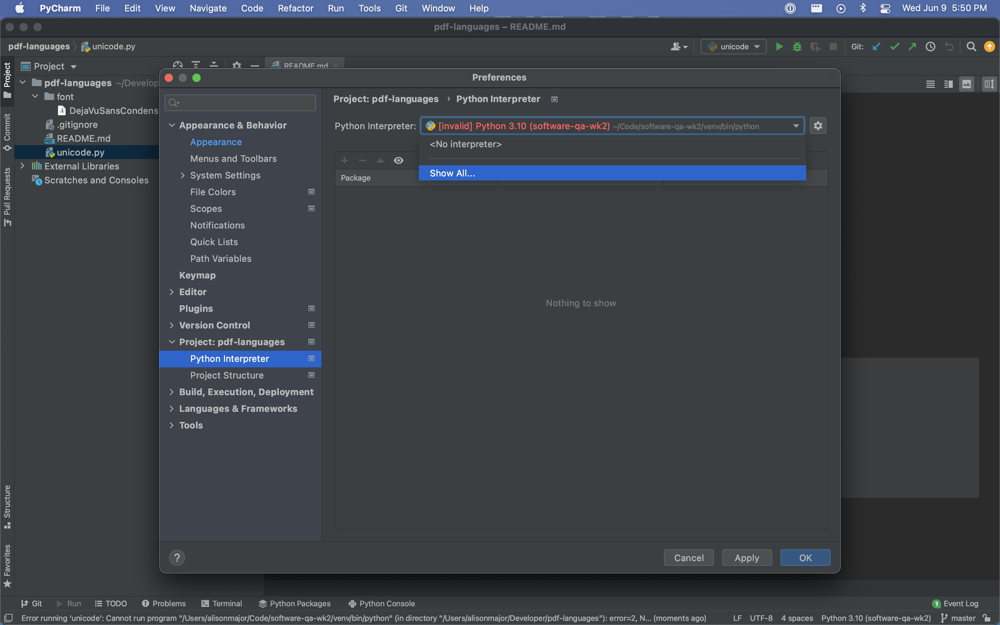
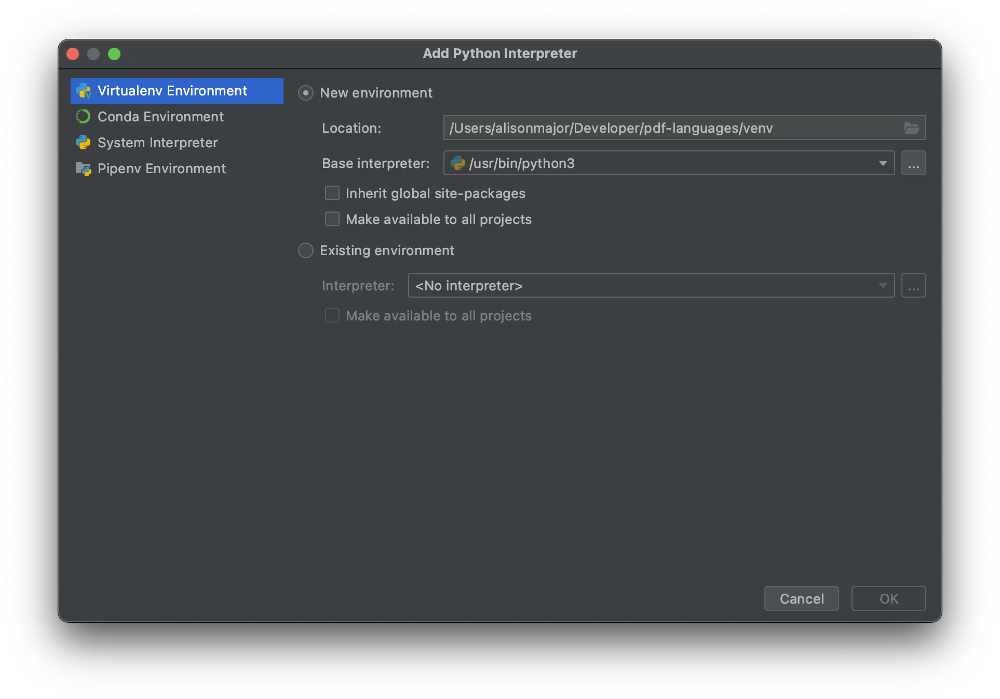
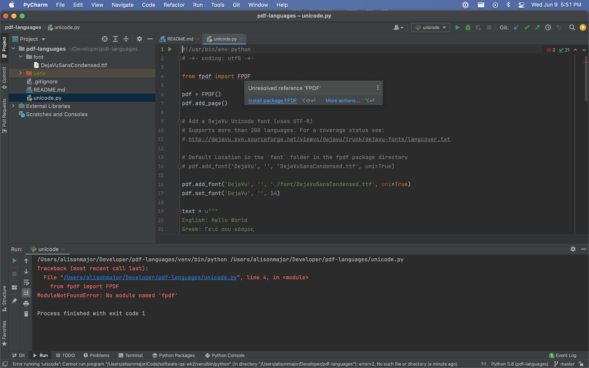

# Setup

Install and use [PyCharm Community Edition](https://www.jetbrains.com/pycharm/download/).

Clone this repository.

## Create the Interpreter

You may need to create a new interpreter.

On a Mac, this is under *PyCharm* --> *Preferences* --> *Project* --> *Python Interpreter*

Then in the *Python Interpreter* dropdown, click on **Show All...**



Select the *New Environment* option and choose a base interpreter. Click **OK**.



## Import Dependencies

In the `unicode.py` file, hover over the imports that are underlined with red.

Click on **Install package ...** for any necessary packages



## Run!

Right-click on `unicode.py` in the project list and choose **Run** to run the program!

A new file, **unicode.pdf** should generate in the same directory.

-----

# Fonts

DejaVu fonts can be downloaded [here](https://dejavu-fonts.github.io/).

We need a copy of `DejaVuSansCondensed.ttf` for this process.

## Generate font to add

1. Go to [fpdf.org/makefont](http://www.fpdf.org/makefont)
2. Upload `DejaVuSansCondensed.ttf` and click _Send_.
3. Download `DejaVuSansCondensed.php` and `DejaVuSansCondensed.z`
4. Add these files to the following folder: `fpdf/font` _(you may need to create this folder)_
5. Include the following code to your file:

```python
# OPTION 1: 
# Default Location in the `font` folder in the fpdf package directory
# pdf.add_font('DejaVu', '', 'DejaVuSansCondensed.ttf', uni=True)

# OPTION 2:
# Provide file location (example is MacOS location)
pdf.add_font('DejaVu', '', '/Library/Fonts/DejaVuSansCondensed.ttf', uni=True)

# Set the font
pdf.set_font('DejaVu', '', 14)
```
